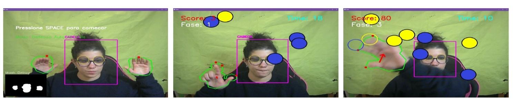
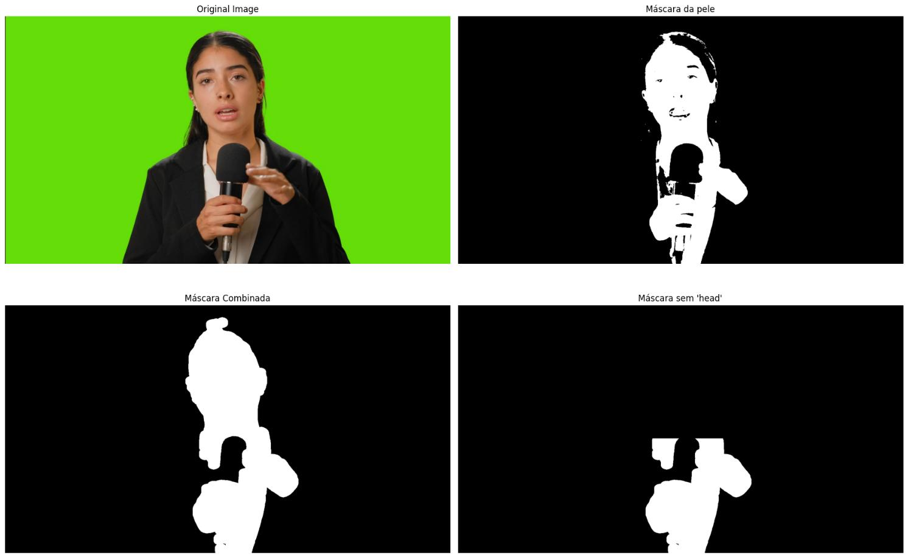
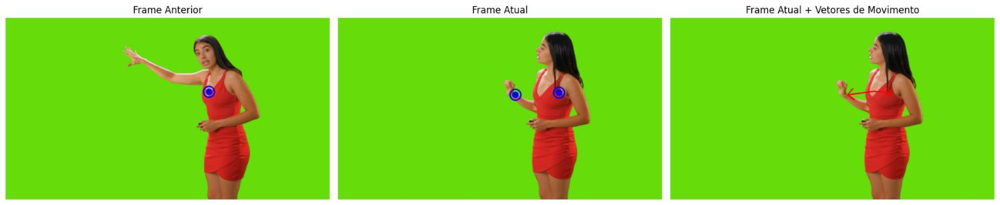
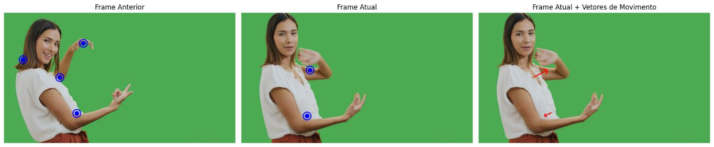

# Augmented Reality — Body as Controller

A computer vision system that turns your hands and head into game controllers, with no special hardware: just a regular webcam.

Built in Python with OpenCV as a university assignment for *Image Processing and Computer Vision*. The core challenge: make a real-time interactive AR experience work reliably in uncontrolled environments, without depth sensors, without ML body tracking libraries, without anything but raw pixel data.

---

## What It Does

Point a webcam at yourself and the app detects your hands and head in real time, overlaying virtual balls you can bat around the screen. Collisions are calculated continuously, touch a ball with your palm and it responds differently than a fingertip tap. An audio cue fires on every hit.




---

## How It Works

The hard part of this project isn't the game, it's reliably isolating a human body from a cluttered, unpredictably lit background using only colour information.

**Skin detection** combines two colour spaces simultaneously (YCrCb and HSV), so a pixel only gets classified as skin if it passes both filters at once. This makes the detection much more robust than relying on a single colour model. The algorithm also samples the image corners each frame to build a live model of the background colour, then subtracts it from the skin mask , so if your wall happens to be a similar tone to your skin, it gets filtered out automatically.

**Head detection** uses a Haar Cascade classifier, the same family of algorithms that powered early face detection in digital cameras , which runs fast enough to not blow the frame budget.

   

**Hand classification** is based on contour geometry. Once a skin blob is found, the algorithm measures how "spiky" its outline is. An open hand has a perimeter roughly twice what you'd expect for a compact shape of the same area, that ratio is what separates hands from faces, arms, or background noise. Finger gaps are confirmed by checking the angles of indentations in the contour's convex hull.

**Motion vectors** are calculated by tracking each hand's centroid between consecutive frames and matching them by nearest-neighbour. Any jump larger than 150px between frames gets discarded as a segmentation glitch rather than real movement.




---

## Tech Stack

| | |
|---|---|
| **Language** | Python |
| **Computer vision** | OpenCV |
| **Numerical processing** | NumPy |
| **Audio feedback** | Pygame |
| **Environment** | Jupyter Notebook |

---

## Running It

```bash
pip install opencv-python numpy pygame
```

Open `T51N-G7-TP2.ipynb` in Jupyter and run all cells. A webcam is required. Works best with reasonable lighting and a reasonably plain background , though that's by design, not a limitation.

---

## Known Behaviour

The system handles most everyday conditions well, but skin-toned clothing near the hands can cause misclassification, and fast gestures occasionally produce motion blur that breaks contour detection for a frame or two. Both are inherent to colour-only segmentation without depth data , the interesting constraint that shaped every decision in this project.
